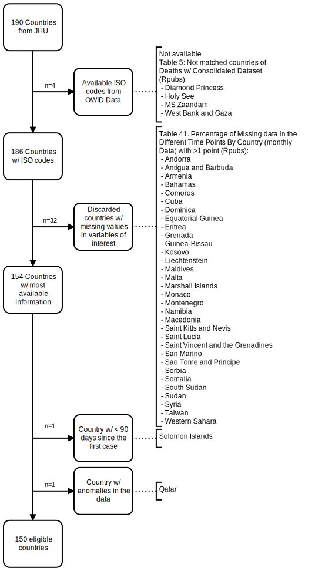

```{r setup, include=FALSE}
knitr::opts_chunk$set(echo = FALSE)

# Learn more about creating websites with Distill at:
# https://rstudio.github.io/distill/website.html
Sys.setlocale("LC_TIME", "English")
```

# date: `r format(Sys.time(), '%d %B, %Y')`

This page is composed by the following main topics:

- Steps of **dataset consolidation** [here](Dataset_Cons_post_ago.html)
  
- You can access our **web app** for exploratory analyses from [here](https://agscl.shinyapps.io/application).
  
- **Codebook** [here](codebook.html)

<br>

The main processes are summarized in the following figures.

<br>

```{r}
  #print()
  knitr::include_graphics(gsub("index.Rmd","country_selection_strobe_nov.svg",rstudioapi::getSourceEditorContext()$path))

```
